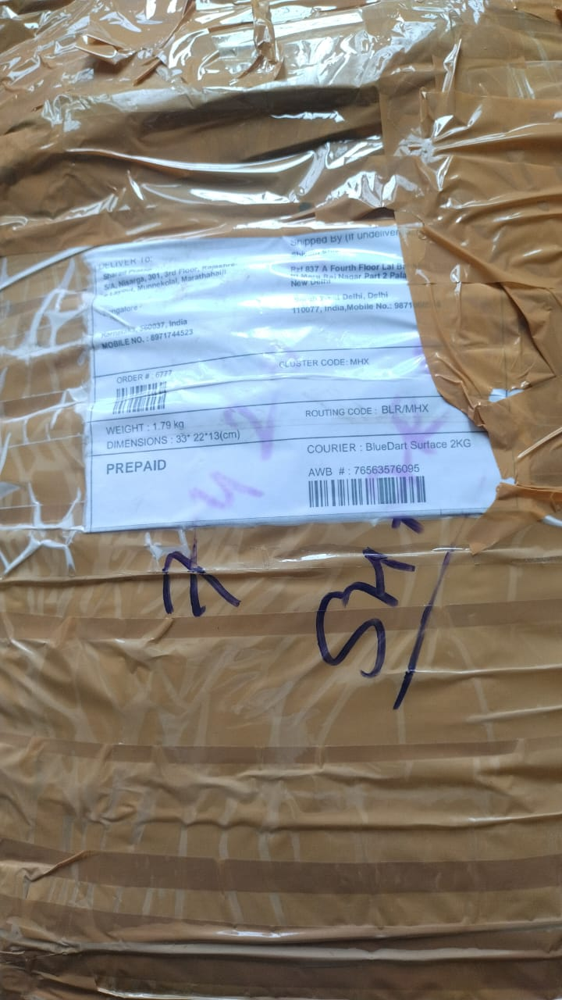
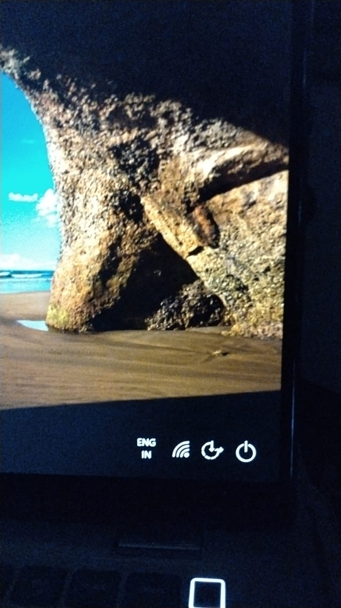

\begin{samepage}

# DECLARATION AND CERTIFICATION OF FORMAL DISPUTE / CHARGEBACK PROCESS

## Transaction

**Transaction Date:** 25/08/2025  
**Amount:** INR 42,990  
**Merchant:** Retechi  
**Axis Bank Credit Card:** Ending 8140  
**Axis Case / Interaction ID:** 260617509883  
**RBI CMS Complaint:** N202627002014056

---

## PURPOSE AND SCOPE

This declaration concerns **only the formal dispute / chargeback process** relating to the above transaction.

**Subsequent communications undertaken by Axis Bank on a "good faith" / goodwill basis after exhaustion of formal chargeback rights are excluded from the interactions recorded below.**

The purpose is to establish the factual record of:

- communications between Axis Bank and the beneficiary / acquiring / merchant bank;
- documents and evidence shared by Axis Bank;
- specifically whether the proof of return supplied by the cardholder was shared with the merchant/acquiring bank;
- responses received from the merchant/acquiring bank; and
- the action or decision taken by Axis Bank after each response.

Where Axis Bank considers any actual communication or document non-disclosable, the Bank is requested to identify the specific basis for non-disclosure.

This declaration does **not** require disclosure of information which Axis Bank is legally prohibited from disclosing.

---

## DOCUMENT AUTHENTICATION AND PAGE-BY-PAGE CERTIFICATION

**Page-by-Page Authentication:**  
Each page of this declaration, including all annexures and attached evidence pages, shall be **initialled or signed by the Principal Nodal Officer or the authorised senior officer signing this declaration**. The initials/signature shall appear on every page and shall be accompanied by the page number (e.g., “Page 1 of 8”). The final page shall contain the officer's full signature, name, designation, date, and official seal/stamp, where applicable.

No page may be omitted, substituted, added, or detached from this declaration after execution without being separately identified, dated, and authenticated by the signing officer.

---

<!-- \newpage -->

\end{samepage}

\begin{samepage}

# INTERACTION 1

**Sending Date:** __________________________________

**Axis Bank officer / designation:**  
__________________________________________________

**Department / Reference / Mode:**  
__________________________________________________

### What did Axis Bank communicate to the merchant/acquiring bank?

__________________________________________________  
__________________________________________________  
__________________________________________________

### Documents / evidence shared by Axis Bank in this interaction

__________________________________________________  
__________________________________________________  
__________________________________________________

### RETURN PROOF

**Was the cardholder's proof of return shared with the merchant/acquiring bank in this interaction?**

- [ ] YES
- [ ] NO
- [ ] OTHER — explain: __________________________________

**If YES, identify the return-proof material shared:**

- [ ] RP-1 — Courier package / return shipment showing merchant's return address
- [ ] RP-2 — Picture/communication supplied by merchant after receiving the returned product
- [ ] Other: __________________________________________

**Date/reference under which the return proof was shared:**

__________________________________________________

**If NO, was the return proof nevertheless considered by Axis Bank in making the chargeback decision?**

- [ ] YES
- [ ] NO
- [ ] OTHER — explain: __________________________________

### Merchant/acquiring bank response

**Response Date:** __________________________________

**Response received:**

__________________________________________________  
__________________________________________________  
__________________________________________________

### What did Axis Bank decide/do after receiving the response?

__________________________________________________  
__________________________________________________  
__________________________________________________

---

<!-- \newpage -->

\end{samepage}

\begin{samepage}

# INTERACTION 2

**Sending Date:** __________________________________

**Axis Bank officer / designation:**  
__________________________________________________

**Department / Reference / Mode:**  
__________________________________________________

### What did Axis Bank communicate to the merchant/acquiring bank?

__________________________________________________  
__________________________________________________  
__________________________________________________

### Documents / evidence shared by Axis Bank

__________________________________________________  
__________________________________________________  
__________________________________________________

### RETURN PROOF

**Was the cardholder's proof of return shared with the merchant/acquiring bank in this interaction?**

- [ ] YES
- [ ] NO
- [ ] OTHER — explain: __________________________________

**If YES, identify the return-proof material shared:**

- [ ] RP-1 — Courier package / return shipment showing merchant's return address
- [ ] RP-2 — Picture/communication supplied by merchant after receiving the returned product
- [ ] Other: __________________________________________

**Date/reference:**

__________________________________________________

### Merchant/acquiring bank response

**Response Date:** __________________________________

**Response received:**

__________________________________________________  
__________________________________________________

### What did Axis Bank decide/do?

__________________________________________________  
__________________________________________________

---

\end{samepage}

\begin{samepage}

# INTERACTION 3

**Sending Date:** __________________________________

**Axis Bank officer / designation:**  
__________________________________________________

**Department / Reference / Mode:**  
__________________________________________________

### What did Axis Bank communicate/share?

__________________________________________________  
__________________________________________________

### Documents / evidence shared

__________________________________________________  
__________________________________________________

### RETURN PROOF

**Was the cardholder's proof of return shared with the merchant/acquiring bank?**

- [ ] YES
- [ ] NO
- [ ] OTHER — explain: __________________________________

**Return-proof material, if shared:**

- [ ] RP-1 — Courier package / return shipment showing merchant's return address
- [ ] RP-2 — Picture/communication supplied by merchant after receiving returned product
- [ ] Other: __________________________________________

**Date/reference:**

__________________________________________________

### Merchant/acquiring bank response

**Response Date:** __________________________________

**Response:**

__________________________________________________  
__________________________________________________

### Next action / decision by Axis Bank

__________________________________________________  
__________________________________________________

---

\end{samepage}

\begin{samepage}

# INTERACTION 4

**Sending Date:** __________________________________

**Axis Bank officer / designation:**  
__________________________________________________

**Department / Reference / Mode:**  
__________________________________________________

### What did Axis Bank communicate/share?

__________________________________________________  
__________________________________________________

### Documents / evidence shared

__________________________________________________  
__________________________________________________

### RETURN PROOF

**Was the cardholder's proof of return shared with the merchant/acquiring bank?**

- [ ] YES
- [ ] NO
- [ ] OTHER — explain: __________________________________

**Return-proof material, if shared:**

- [ ] RP-1 — Courier package / return shipment showing merchant's return address
- [ ] RP-2 — Picture/communication supplied by merchant after receiving returned product
- [ ] Other: __________________________________________

**Date/reference:**

__________________________________________________

### Merchant/acquiring bank response

**Response Date:** __________________________________

**Response:**

__________________________________________________  
__________________________________________________

### Next action / decision by Axis Bank

__________________________________________________  
__________________________________________________

---

\end{samepage}

\begin{samepage}

# INTERACTION 5

**Sending Date:** __________________________________

**Axis Bank officer / designation:**  
__________________________________________________

**Department / Reference / Mode:**  
__________________________________________________

### What did Axis Bank communicate/share?

__________________________________________________  
__________________________________________________

### Documents / evidence shared

__________________________________________________  
__________________________________________________

### RETURN PROOF

**Was the cardholder's proof of return shared with the merchant/acquiring bank?**

- [ ] YES
- [ ] NO
- [ ] OTHER — explain: __________________________________

**Return-proof material, if shared:**

- [ ] RP-1 — Courier package / return shipment showing merchant's return address
- [ ] RP-2 — Picture/communication supplied by merchant after receiving returned product
- [ ] Other: __________________________________________

**Date/reference:**

__________________________________________________

### Merchant/acquiring bank response

**Response Date:** __________________________________

**Response:**

__________________________________________________  
__________________________________________________

### Next action / decision by Axis Bank

__________________________________________________  
__________________________________________________

---

\end{samepage}

\begin{samepage}

# INTERACTION 6

**Sending Date:** __________________________________

**Axis Bank officer / designation:**  
__________________________________________________

**Department / Reference / Mode:**  
__________________________________________________

### What did Axis Bank communicate/share?

__________________________________________________  
__________________________________________________

### Documents / evidence shared

__________________________________________________  
__________________________________________________

### RETURN PROOF

**Was the cardholder's proof of return shared with the merchant/acquiring bank?**

- [ ] YES
- [ ] NO
- [ ] OTHER — explain: __________________________________

**Return-proof material, if shared:**

- [ ] RP-1 — Courier package / return shipment showing merchant's return address
- [ ] RP-2 — Picture/communication supplied by merchant after receiving returned product
- [ ] Other: __________________________________________

**Date/reference:**

__________________________________________________

### Merchant/acquiring bank response

**Response Date:** __________________________________

**Response:**

__________________________________________________  
__________________________________________________

### Next action / decision by Axis Bank

__________________________________________________  
__________________________________________________

---

\end{samepage}

\begin{samepage}

# RETURN-PROOF IDENTIFICATION

For clarity, the return evidence referred to in this declaration is:

### RP-1 — Courier return evidence

Picture showing the courier package being sent/returned to the merchant, including the merchant's return address.

### RP-2 — Merchant receipt evidence

Picture/communication supplied by the merchant after receiving the returned product.

### Additional defect evidence

Evidence showing the defective/broken display and the condition of the product.

> **Important:** RP-1 and RP-2 are identified separately so that Axis Bank can state precisely whether either item was actually transmitted to the merchant/acquiring bank during the formal dispute process.

---

# MERCHANT / ACQUIRING BANK IDENTIFICATION

**Legal / official name:**

__________________________________________________

**Role:**

- [ ] Beneficiary Bank
- [ ] Acquiring Bank
- [ ] Merchant Bank
- [ ] Other: _________________________________________

**Officer name, if disclosable:**

__________________________________________________

**If individual name cannot be disclosed, designation:**

__________________________________________________

**Official business email:**

__________________________________________________

**Official business/postal address:**

__________________________________________________  
__________________________________________________

**Official contact number, if lawfully disclosable:**

__________________________________________________

---

# NON-DISCLOSURE OF COMMUNICATIONS / DOCUMENTS

If Axis Bank states that any communication, document, officer identity, merchant-bank identity or response cannot be disclosed, please specify:

**Item not disclosed:**

__________________________________________________

**Reason for non-disclosure:**

- [ ] Law
- [ ] RBI direction/regulation
- [ ] Card-network rule
- [ ] Contractual restriction
- [ ] Bank policy
- [ ] Confidentiality obligation
- [ ] Other: _________________________________________

**Specific rule / clause / provision relied upon:**

__________________________________________________  
__________________________________________________

**Does the stated restriction also prevent Axis Bank from answering the factual question whether the return proof was shared with the merchant/acquiring bank?**

- [ ] YES
- [ ] NO
- [ ] OTHER — explain: _________________________________

**If the actual communication cannot be provided, can Axis Bank provide a factual summary of the communication and its outcome?**

- [ ] YES
- [ ] NO
- [ ] OTHER — explain: _________________________________

---

\end{samepage}

\begin{samepage}

# CERTIFICATION

We certify that the information provided in this declaration has been verified against the records available with Axis Bank concerning the **formal dispute / chargeback process** for the transaction identified above.

We certify that the information provided is true and accurate to the best of our knowledge based on the Bank's records.

Where a requested fact cannot be established from the records available, the answer shall state:

> **"Not ascertainable from the records available to us."**

Where any information or document has not been disclosed, the specific basis for such non-disclosure has been identified above.

This certification concerns the **formal dispute / chargeback process only** and does not include subsequent communications undertaken by Axis Bank on a "good faith" / goodwill basis after exhaustion of formal chargeback rights, unless expressly identified as part of the formal process.

---

# PRINCIPAL NODAL OFFICER

**Name:** _________________________________________

**Designation:** Principal Nodal Officer

**Official Email:** __________________________________

**Date:** __________________________________________

**Signature:** _____________________________________

**Official Seal:** __________________________________

---

# NODAL OFFICER

**Name:** _________________________________________

**Designation:** Nodal Officer

**Official Email:** __________________________________

**Date:** __________________________________________

**Signature:** _____________________________________

**Official Seal:** __________________________________

---

# MD & CEO / AUTHORISED SENIOR OFFICER

**Name:** _________________________________________

**Designation:** ___________________________________

**Official Email:** __________________________________

**Date:** __________________________________________

**Signature:** _____________________________________

**Official Seal:** __________________________________

---

## Reference Documents

1. Axis Bank Cardholder Dispute Form.
2. Reserve Bank - Integrated Ombudsman Scheme, 2026.
3. Relevant correspondence and documents submitted by the cardholder concerning the disputed transaction.

\end{samepage}

### RP-1 — Courier return evidence

### RP-2 — Merchant receipt evidence

